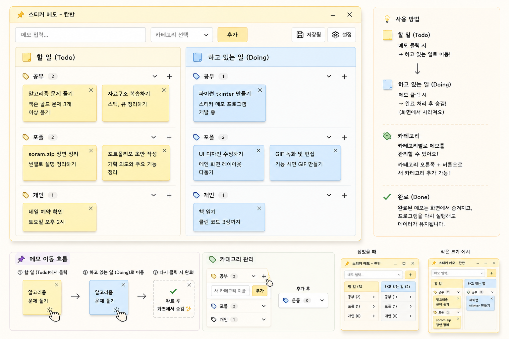

# Todi

데스크톱에 붙여놓는 칸반 메모 앱. 할 일을 카드로 만들어 **Todo → Doing → Done** 흐름으로 관리합니다.



## 다운로드

[최신 버전 다운로드](https://github.com/ssoram/Todi/releases/latest)

| OS | 파일 |
|---|---|
| Windows | `Todi_x.x.x_x64-setup.exe` |
| macOS | `Todi_x.x.x_aarch64.dmg` |

설치 후 업데이트는 자동으로 적용됩니다.

## 주요 기능

- **칸반 보드** — Todo, Doing, Done 세 단계로 작업 흐름 관리
- **독립 창** — 각 보드가 별도 창으로 열려 바탕화면 어디든 배치 가능
- **카테고리** — 메모를 카테고리별로 분류, 드래그로 순서 변경
- **시스템 트레이** — 닫아도 트레이에 상주, 언제든 빠르게 접근
- **자동 시작** — 컴퓨터 켜면 자동 실행
- **휴지통** — 삭제한 메모를 복원하거나 영구 삭제
- **폰트 설정** — 시스템 폰트 중 원하는 폰트와 크기 선택
- **자동 업데이트** — 새 버전이 나오면 앱 실행 시 자동 반영
- **위치 기억** — 창 위치와 크기를 저장하여 다음 실행 시 복원

## 사용법

1. **메모 추가** — 패널에서 제목 입력 후 카테고리를 선택하고 추가
2. **상태 이동** — 카드의 버튼으로 Todo → Doing → Done 이동
3. **메모 수정** — 카드의 수정 버튼으로 제목, 내용, 카테고리 변경
4. **카테고리 관리** — 패널의 카테고리 버튼에서 추가, 삭제, 이름 변경, 드래그 정렬
5. **창 관리** — 각 창을 자유롭게 배치하고, 트레이 아이콘으로 열기/닫기

## 기술 스택

| 영역 | 기술 |
|---|---|
| 프레임워크 | [Tauri 2](https://tauri.app/) |
| 백엔드 | Rust |
| 프론트엔드 | HTML, CSS, JavaScript (프레임워크 없음) |
| 빌드/배포 | GitHub Actions, NSIS (Windows), DMG (macOS) |
| 자동 업데이트 | tauri-plugin-updater |

## 빌드

```bash
cd sticker-tauri
npm install
npm run tauri dev     # 개발 모드
npm run tauri build   # 릴리스 빌드
```

**요구사항**: [Node.js](https://nodejs.org/) 18+, [Rust](https://rustup.rs/) 1.70+

## 라이선스

MIT
